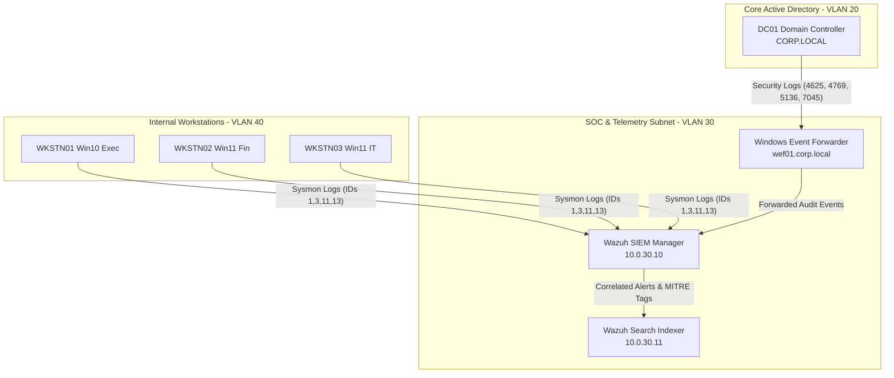

# Enterprise SOC & Blue Team Home Lab Blueprint

[](docs/architecture.md)
[](docs/architecture.md)
[](docs/architecture.md)
[](docs/detection_use_cases.md)
[](docs/detection_use_cases.md)
[](docs/topology.md)
[](tests/validate_blueprint.ps1)
[](LICENSE)

---

## ⚡ 60-Second Quick Review Guide

> **Targeting Roles**: **SOC Tier 1 Analyst**, **Cybersecurity Engineer**, **IAM Administrator**, **Systems / Infrastructure Engineer**.

Welcome! This repository documents a proposed enterprise-simulated SOC blue-team home-lab blueprint (`CORP.LOCAL`). It is a reproducible reference design—not evidence of a currently provisioned environment—for Active Directory hardening, SIEM telemetry, and mapped incident-response exercises.

### Core Engineering Highlights
- **Active Directory Architecture (`CORP.LOCAL`)**: Multi-tiered domain hierarchy with 5 dedicated OUs (`Executive`, `IT`, `Finance`, `Workstations`, `Servers`), GPO baseline enforcement, Microsoft LAPS deployment, and NTLMv1/SMBv1 deprecation.
- **5-Subnet Network Zoning**: Fully isolated network topology spanning Management, Core AD, SOC/SIEM, Endpoints, and DMZ subnets backed by a strict Zero Trust Firewall Policy Matrix.
- **SIEM & Sysmon Telemetry Pipeline**: Wazuh Manager 4.7 & Indexer cluster receiving Windows Event Forwarding (WEF) and Sysmon v15 modular logs with custom XML decoders and detection rules.
- **MITRE ATT&CK & NIST SP 800-61 Detection Use-Cases**: 4 production detection blueprints (Password Spraying T1110, Kerberoasting T1558, GPO Tampering T1484, PsExec Lateral Movement T1021) featuring complete 4-phase incident response workflows (Preparation, Detection & Analysis, Containment/Eradication, Post-Incident).

### Architecture Quick-Nav Matrix

| Document | Primary Focus | Key Content |
|---|---|---|
| 📄 [`docs/architecture.md`](docs/architecture.md) | AD DS & SIEM Blueprint | `CORP.LOCAL` OU tree, GPO baselines, LAPS setup, Sysmon schema, WEF pipeline, Wazuh XML rules |
| 🌐 [`docs/topology.md`](docs/topology.md) | Network Topology & Hardware | Mermaid topology diagram, 5-subnet IP table, Firewall Policy Matrix, Proxmox hypervisor specs |
| 🛡️ [`docs/detection_use_cases.md`](docs/detection_use_cases.md) | SOC Detection & IR | 4 detailed MITRE ATT&CK use-cases (UC-01 to UC-04) with complete NIST SP 800-61 IR playbooks |

---

## High-Level Data Flow & Telemetry Architecture



---

## Project Structure

```text
home-lab-blue-team/
├── README.md                     # Profile-ready landing page & 60-sec review guide
├── docs/
│   ├── architecture.md           # AD DS setup, OU tree, GPO baselines, LAPS, Sysmon & Wazuh rules
│   ├── topology.md               # Mermaid network diagram, 5-subnet IP layout, firewall matrix
│   └── detection_use_cases.md    # UC-01 to UC-04 detection rules and NIST SP 800-61 IR playbooks
└── tests/
    └── validate_blueprint.ps1    # Automated blueprint verification script (100% PASS)
```

---

## Detection Use-Case Summary

| Use Case | MITRE ID | Target Telemetry | Detection Logic Summary | NIST IR Playbook |
|---|---|---|---|---|
| **UC-01: Password Spraying** | `T1110.003` | Event ID 4625 | >8 failed logons from same source IP across multiple users within 300s | [View Playbook](docs/detection_use_cases.md#uc-01-password-spraying-attack) |
| **UC-02: Kerberoasting** | `T1558.003` | Event ID 4769 | TGS ticket requested with RC4 encryption (`0x17`) for non-machine service account | [View Playbook](docs/detection_use_cases.md#uc-02-kerberoasting-attack) |
| **UC-03: GPO Tampering** | `T1484.001` | Event ID 5136 & Sysmon ID 11 | Modification to `gPCFileSysPath` / `gPCMachineExtensionNames` or file edit in SYSVOL | [View Playbook](docs/detection_use_cases.md#uc-03-group-policy-object-tampering) |
| **UC-04: PsExec Movement** | `T1021.002` | Event ID 7045 & Sysmon IDs 1/3 | Installation of `PSEXESVC` service or process creation of `psexesvc.exe` | [View Playbook](docs/detection_use_cases.md#uc-04-psexec-lateral-movement) |

---

## Verification & Compliance Alignment

All architectural components have been validated against industry cybersecurity standards:
- **NIST SP 800-61 Rev. 2**: Legacy four-phase exercise structure; Rev. 3 is current guidance.
- **MITRE ATT&CK**: Technique mappings across Credential Access, Defense Evasion, and Lateral Movement.
- **CIS Controls v8**: Controls 4 (Secure Configuration), 5 (Account Management), 6 (Access Control Management), and 8 (Audit Log Management).

To execute the automated verification test suite:
```powershell
powershell.exe -ExecutionPolicy Bypass -File .\tests\validate_blueprint.ps1
```

## License

Released under the [MIT License](LICENSE).
