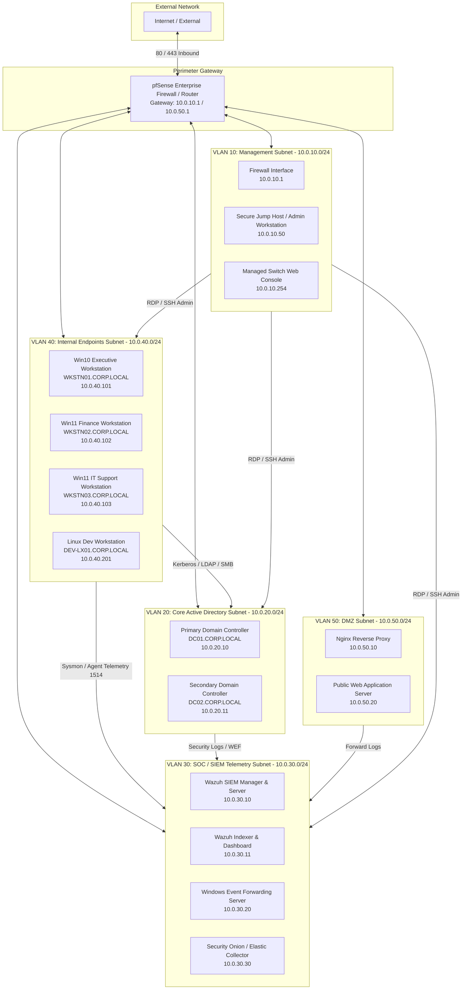

# Enterprise Network Topology & Subnet Blueprint

This document defines the network architecture, 5-subnet IP addressing plan, firewall policy matrix, and virtualization host specifications for the enterprise SOC blue-team home lab (`CORP.LOCAL`).

---

## 1. Network Topology Diagram

---

## 2. 5-Subnet IP Layout Table

| Subnet Name | CIDR Block | VLAN ID | Gateway IP | Reserved Range | Node IP | Hostname | Operating System | Purpose / Installed Services |
|---|---|---|---|---|---|---|---|---|
| **Management** | `10.0.10.0/24` | VLAN 10 | `10.0.10.1` | `10.0.10.1-10.0.10.49` | `10.0.10.1` | `fw01.corp.local` | pfSense 2.7.2 | Perimeter Gateway, Router, Firewall, DNS Resolver |
| | | | | | `10.0.10.50` | `jump01.corp.local` | Windows Server 2022 | Out-of-band Admin Jump Host (Guacamole / RSAT / SSH) |
| | | | | | `10.0.10.254` | `sw-core01.corp.local` | Cisco SG350-28P | L3 Core Managed Switch Console |
| **Core AD** | `10.0.20.0/24` | VLAN 20 | `10.0.20.1` | `10.0.20.1-10.0.20.9` | `10.0.20.10` | `DC01.CORP.LOCAL` | Windows Server 2022 | Primary Domain Controller, Active Directory Domain Services, DNS, KDC, LAPS |
| | | | | | `10.0.20.11` | `DC02.CORP.LOCAL` | Windows Server 2022 | Secondary Domain Controller, AD DS Replica, Backup DNS |
| **SOC / SIEM** | `10.0.30.0/24` | VLAN 30 | `10.0.30.1` | `10.0.30.1-10.0.30.9` | `10.0.30.10` | `wazuh-mgr.corp.local` | Ubuntu 22.04 LTS | Wazuh Manager 4.7, Alert Engine, Custom Rulesets |
| | | | | | `10.0.30.11` | `wazuh-idx.corp.local` | Ubuntu 22.04 LTS | Wazuh Indexer & OpenSearch Dashboard |
| | | | | | `10.0.30.20` | `wef01.corp.local` | Windows Server 2022 | Windows Event Forwarding Collector Server |
| | | | | | `10.0.30.30` | `sec-onion.corp.local` | Security Onion 2.4 | Network Security Monitoring (Zeek, Suricata, Stenographer) |
| **Endpoints** | `10.0.40.0/24` | VLAN 40 | `10.0.40.1` | `10.0.40.1-10.0.40.99` | `10.0.40.101` | `WKSTN01.CORP.LOCAL` | Windows 10 Enterprise | Executive Workstation (OU=Executive) |
| | | | | | `10.0.40.102` | `WKSTN02.CORP.LOCAL` | Windows 11 Enterprise | Finance Workstation (OU=Finance) |
| | | | | | `10.0.40.103` | `WKSTN03.CORP.LOCAL` | Windows 11 Enterprise | IT Support Workstation (OU=IT) |
| | | | | | `10.0.40.201` | `DEV-LX01.CORP.LOCAL` | Ubuntu 22.04 Workstation | Linux Developer Workstation (OU=Workstations) |
| **DMZ** | `10.0.50.0/24` | VLAN 50 | `10.0.50.1` | `10.0.50.1-10.0.50.9` | `10.0.50.10` | `proxy01.corp.local` | Ubuntu 22.04 LTS | Nginx Reverse Proxy & SSL Termination |
| | | | | | `10.0.50.20` | `web01.corp.local` | Ubuntu 22.04 LTS | Public Customer Portal Web Server |

---

## 3. Firewall Policy Matrix

Traffic flow between subnets is governed by explicit Stateful Firewall rules adhering to Least-Privilege Network Access (Zero Trust zoning):

| Rule # | Source Subnet | Destination Subnet | Destination Port / Service | Action | Rationale & Security Controls |
|---|---|---|---|---|---|
| **FW-01** | `Management` (`10.0.10.0/24`) | `ANY` | TCP 22 (SSH), TCP 3389 (RDP), TCP 443 (HTTPS) | **ALLOW** | Administrative access to all endpoints, servers, and hypervisors via Jump Host. |
| **FW-02** | `Endpoints` (`10.0.40.0/24`) | `Core AD` (`10.0.20.0/24`) | UDP/TCP 53 (DNS), UDP/TCP 88 (Kerberos), TCP 135 (RPC), TCP 389/636 (LDAP/LDAPS), TCP 445 (SMB), UDP/TCP 464 (kpasswd) | **ALLOW** | Standard Active Directory domain join, authentication, and GPO sync services. |
| **FW-03** | `Endpoints` (`10.0.40.0/24`) | `SOC / SIEM` (`10.0.30.0/24`) | TCP 1514 / 1515 (Wazuh Agent), TCP 514 (Syslog) | **ALLOW** | Endpoint telemetry log shipping to SIEM. |
| **FW-04** | `Core AD` (`10.0.20.0/24`) | `SOC / SIEM` (`10.0.30.0/24`) | TCP 1514 / 1515 (Wazuh Agent), TCP 5985/5986 (WinRM for WEF) | **ALLOW** | Domain controller security auditing and WEF log forwarding. |
| **FW-05** | `DMZ` (`10.0.50.0/24`) | `Core AD` (`10.0.20.0/24`) | ALL | **DENY** | **DMZ Isolation Policy**: DMZ hosts cannot initiate connections to internal AD Core under any circumstances. |
| **FW-06** | `DMZ` (`10.0.50.0/24`) | `SOC / SIEM` (`10.0.30.0/24`) | TCP 1514 / 1515 (Wazuh Agent) | **ALLOW** | Shipping DMZ web/proxy logs to SIEM. |
| **FW-07** | `WAN` (Internet) | `DMZ` (`10.0.50.0/24`) | TCP 80 (HTTP), TCP 443 (HTTPS) | **ALLOW** | Public web traffic directed exclusively to Nginx Reverse Proxy (`10.0.50.10`). |
| **FW-08** | `Endpoints` (`10.0.40.0/24`) | `Endpoints` (`10.0.40.0/24`) | TCP 445 (SMB), TCP 135/139 (NetBIOS/RPC), TCP 5985/5986 (WinRM) | **DENY** | **Workstation-to-Workstation Isolation**: Prevents lateral movement (PsExec, WMI) across endpoint devices. |
| **FW-09** | `ANY` | `ANY` | ANY | **DENY LOG** | Default Implicit Deny rule with logging for SOC analysis. |

---

## 4. Virtualization Host Specifications

The lab is deployed on a dedicated physical hypervisor node running Proxmox VE 8.1 / VMware ESXi 8.0:

### Physical Hardware Specifications
- **CPU**: AMD Ryzen 9 7900X (12 Cores / 24 Threads @ 4.7GHz Base, 5.6GHz Boost)
- **RAM**: 64 GB DDR5-5600 ECC Unbuffered RAM
- **Storage**: 
  - Host System: 500 GB NVMe PCIe 4.0 SSD (ZFS Mirror for Hypervisor OS)
  - VM Storage: 2 TB NVMe PCIe 4.0 SSD (Datastore for High-IOPS VMs: DCs, SIEM, DBs)
  - Log Retention: 4 TB SATA Enterprise HDD (Cold storage for PCAPs and historical indexer logs)
- **Networking**: Quad-Port Intel I350 Gigabit PCIe NIC (Dedicated to VLAN Trunking and Virtual Bridges)

### Virtual Machine Resource Allocation Matrix

| VM Name | Role | vCPU Cores | RAM (GB) | Disk Size (GB) | Virtual Network Bridge |
|---|---|---|---|---|---|
| `fw01-pfsense` | Firewall & Routing | 2 | 4 | 32 | `vmbr0` (WAN), `vmbr10-50` (Trunk) |
| `DC01-Primary` | AD DC, DNS, KDC | 4 | 8 | 100 | `vmbr20` (VLAN 20) |
| `DC02-Secondary` | AD DC Replica | 2 | 4 | 80 | `vmbr20` (VLAN 20) |
| `wazuh-manager` | SIEM Core Manager | 4 | 12 | 250 | `vmbr30` (VLAN 30) |
| `wazuh-indexer` | SIEM Search Indexer | 4 | 12 | 300 | `vmbr30` (VLAN 30) |
| `wef-syslog` | Event Forwarder | 2 | 4 | 100 | `vmbr30` (VLAN 30) |
| `WKSTN01-Executive` | Win10 Endpoint | 2 | 4 | 60 | `vmbr40` (VLAN 40) |
| `WKSTN02-Finance` | Win11 Endpoint | 2 | 4 | 60 | `vmbr40` (VLAN 40) |
| `WKSTN03-ITSupport` | Win11 Endpoint | 2 | 4 | 60 | `vmbr40` (VLAN 40) |
| `DEV-LX01` | Linux Dev Endpoint | 2 | 4 | 50 | `vmbr40` (VLAN 40) |
| `proxy01-dmz` | Reverse Proxy | 1 | 2 | 30 | `vmbr50` (VLAN 50) |
| **Total Allocation** | -- | **25 / 24 vCPUs** | **56 / 64 GB** | **1,122 GB** | -- |
